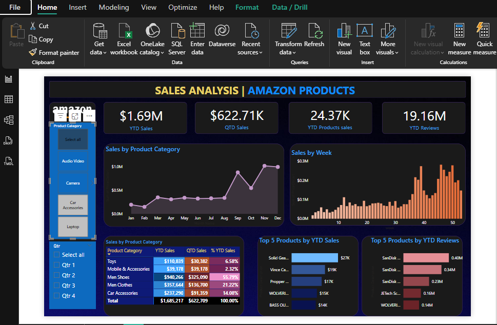

# 📊 amazon-sales-analysis-powerbi
Interactive Power BI dashboard analyzing Amazon sales data, KPIs, and customer insights for business decision-making.

## 📌 Project Overview -

This project is a Sales Analysis Dashboard built in Power BI using Amazon product sales data. It focuses on analyzing sales performance, product trends, and customer feedback to generate actionable business insights.

## 🎯 Business Objective -

* Monitor overall sales performance
* Identify top-performing products
* Track seasonal trends
* Analyze customer feedback using reviews
* Support data-driven decision-making

## 🛠 Tools & Technologies-

* Power BI
* DAX (Data Analysis Expressions)
* Data Modeling
* Data Visualization

## 📊 Key KPIs-

* YTD (Year-to-Date) Sales
* QTD (Quarter-to-Date) Sales
* YTD Products Sold
* YTD Reviews

## 📈 Dashboard Features-

* Monthly Sales Trend (Line Chart)
* Weekly Sales Analysis (Column Chart)
* Sales by Category
* Top 5 Products by Sales
* Top 5 Products by Reviews
* Interactive Slicers (Category & Quarter)

## 🔍 DAX Functions Used - 

* SUM()
* TOTALYTD()
* CALCULATE()
* FILTER()
* TOPN()
* DIVIDE()

## 📊 Key Insights -

* Sales peak during October–December
* Some categories generate higher revenue
* A few products contribute most of the sales
* High reviews do not always mean high sales

## ⚡ Challenges Faced -

* Implementing accurate YTD calculations
* Managing data model relationships
* Handling filter context in DAX
* Designing a clean and interactive dashboard

## 🚀 Performance Optimization -

* Removed unnecessary columns
* Optimized data model
* Reduced visuals per page
* Applied star schema approach
* Optimized DAX calculations

## 📁 Dataset

* Source: The data used in this project is sourced from a youtube tutorial for learning purpose.

## 🎤 Key Highlights Questions-

### ✔ Why did I use YTD and QTD?

YTD helps track overall yearly performance, while QTD shows short-term quarterly trends. This helps compare long-term and short-term growth.

### ✔ What insights did I find?

Sales peak in the last quarter, some categories generate higher revenue, and a few products dominate total sales.

### ✔ What was the most challenging part for me ?

Implementing correct YTD calculations and handling filter context in DAX.

## 💼 Business Impact -

* Helps identify high-performing products
* Improves sales strategy
* Enables better decision-making
* Provides customer behavior insights

## 🚀 Conclusion -

This project demonstrates how Power BI and DAX can be used to transform raw data into meaningful business insights and support strategic decisions.

## 📷 Dashboard Preview

